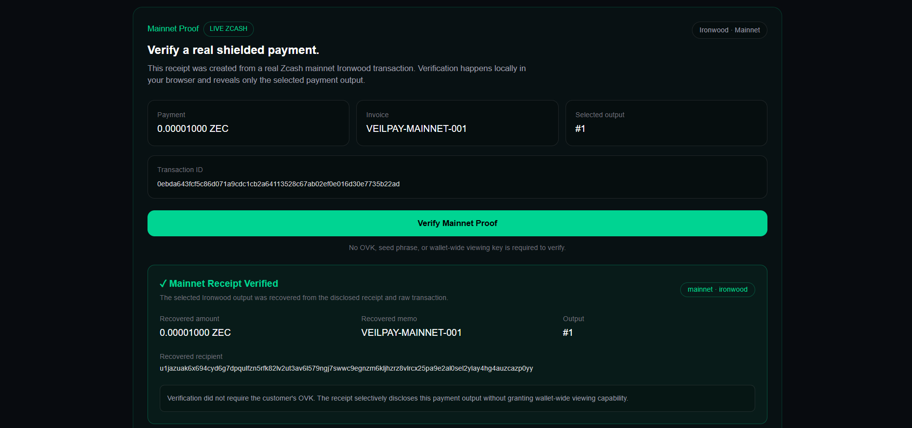
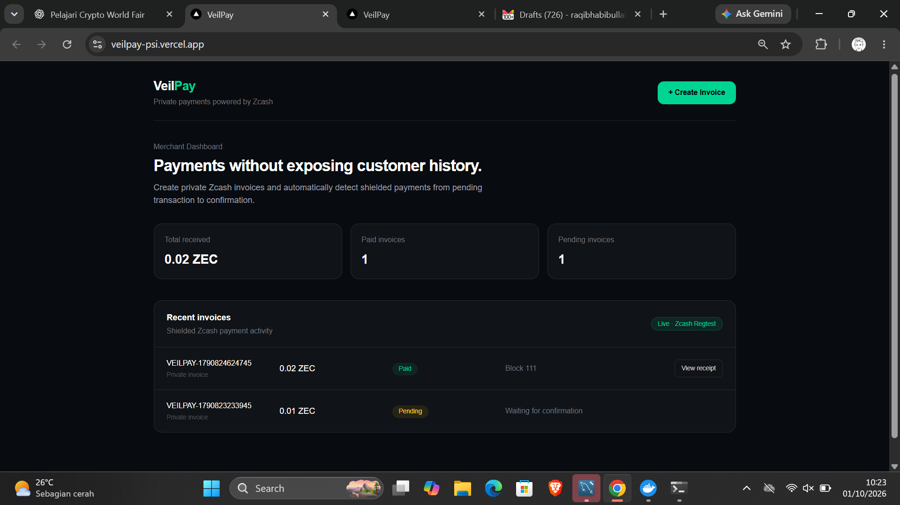
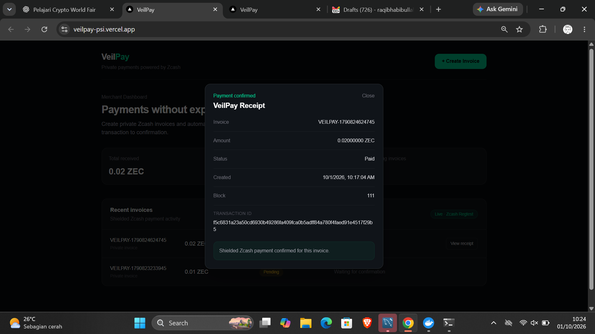

# VeilPay

**Private commerce with selectively verifiable Zcash receipts.**

VeilPay is a privacy-preserving payment prototype for merchants. It combines shielded Zcash checkout with selective payment disclosure: a customer can prove one specific payment without giving a verifier wallet-wide viewing capability.

Built for **Crypto World's Fair 2026**.

## Live Demo

**Production:** https://veilpay-psi.vercel.app

The deployed application includes an interactive **Mainnet Proof**. Click **Verify Mainnet Proof** to cryptographically verify a real Zcash mainnet Ironwood payment directly in the browser.

No customer OVK, seed phrase, or wallet-wide viewing key is required by the verifier.

### Mainnet Proof — Verified in Browser



*Real Zcash mainnet Ironwood transaction selectively verified in-browser using VeilPay's WebAssembly verifier.*

## What VeilPay Solves

Public blockchains can make ordinary commerce unnecessarily revealing.

A merchant may need evidence that a specific payment happened, while a customer may not want to expose unrelated wallet activity, balances, or transaction history.

VeilPay separates those concerns:

1. Pay privately using shielded ZEC.
2. Settle directly to the merchant.
3. Detect and track the payment.
4. Generate a receipt for one selected payment output.
5. Allow a third party to verify that output without receiving wallet-wide viewing capability.

The core idea is:

> **Private by default. Provable when needed.**

## Real Mainnet Proof

VeilPay includes a reproducible selective-disclosure proof built from a real Zcash mainnet transaction.

### Mainnet transaction

- **Network:** Zcash Mainnet
- **Pool:** Ironwood
- **Transaction version:** V6
- **Amount disclosed:** `0.00001000 ZEC` / `1000 zatoshis`
- **Memo:** `VEILPAY-MAINNET-001`
- **Selected output:** `#1`
- **TXID:** `0ebda643fcf5c86d071a9cdc1cb2a64113528c67ab02ef0e016d30e7735b22ad`

The transaction contains multiple Ironwood actions. VeilPay does not assume that the payment is output `0`; the correct selected output is explicitly identified and verified.

### Browser verification

The public demo loads:

- `public/proofs/veilpay-mainnet-receipt.json`
- `public/proofs/veilpay-mainnet-tx.hex`

The browser then runs the WebAssembly verifier locally.

A successful verification recovers only the selected payment details:

```text
Mainnet Receipt Verified

Network: mainnet
Pool: ironwood
Amount: 0.00001000 ZEC
Memo: VEILPAY-MAINNET-001
Output: #1
```

The verifier does **not** need the customer's OVK.

The receipt contains an output-specific disclosure key used to recover the selected output, rather than granting wallet-wide viewing capability.

## Selective Receipt Flow

```text
Customer wallet
      |
      | shielded ZEC payment
      v
Zcash Mainnet / Ironwood
      |
      | transaction
      v
Selected payment output
      |
      | sender-side local receipt generation
      | using OVK locally
      v
Selective receipt
      |
      | receipt + public raw transaction
      v
Browser WASM verifier
      |
      +--> recipient
      +--> amount
      +--> memo
      +--> selected output
      |
      v
VERIFIED

Customer OVK is not given to the verifier.
```

Receipt generation and verification are intentionally separate.

The sender's OVK is used locally when creating the selective receipt. Verification uses the resulting receipt and transaction data and does not require the OVK.

## Merchant Checkout MVP

VeilPay also implements an end-to-end merchant checkout flow.

### Merchant Dashboard



### Payment Receipt



The checkout prototype includes:

- Merchant dashboard
- ZEC invoice creation
- Zcash payment URI generation
- QR code checkout
- Invoice ID embedded in the payment memo
- Automatic shielded payment detection
- Exact invoice matching by merchant account, memo, and amount
- Pending payment detection before confirmation
- Automatic Pending → Paid status updates
- Live dashboard polling
- Payment receipts with TXID and mined block
- Persistent invoice storage with Neon Postgres
- Browser-side selective receipt generation
- Browser-side selective receipt verification
- Ironwood receipt support

The automated merchant payment-detection lifecycle was tested end-to-end in a controlled Zcash regtest environment using Z3/Zallet.

The selective receipt verifier was additionally demonstrated against a **real Zcash mainnet Ironwood transaction**.

## Checkout Flow

```text
Merchant
   |
   v
Create Invoice
   |
   v
VeilPay generates payment request + QR
   |
   v
Customer sends shielded ZEC
   |
   v
Zcash wallet / network
   |
   v
VeilPay detects memo + amount
   |
   +---- unconfirmed ----> Pending
   |
   +---- mined ----------> Paid
                              |
                              v
                           Receipt
```

## Architecture

VeilPay currently demonstrates two complementary paths.

### 1. Merchant payment infrastructure

```text
Browser
   |
   v
Next.js Merchant Dashboard
   |
   v
VeilPay API
   |
   +--> Neon Postgres
   |
   +--> Zcash RPC Router
            |
            v
          Zallet
            |
            v
          Zebra
            |
            v
       Zcash Regtest
```

This path demonstrates invoice creation, automatic shielded payment detection, confirmation tracking, and merchant receipts.

### 2. Selective mainnet verification

```text
Real Zcash Mainnet Ironwood Transaction
                +
        Selective Receipt
                |
                v
        VeilPay Web App
                |
                v
       Browser WebAssembly
                |
                v
       Selected Output Only
                |
                +--> recipient
                +--> amount
                +--> memo
                |
                v
             VERIFIED
```

The public Mainnet Proof does not depend on the developer's local Z3/Zallet environment.

## Privacy Model

VeilPay is designed around **data minimization**.

A normal payment should not require a customer to disclose unrelated wallet history.

When proof is needed, VeilPay's selective receipt flow discloses one selected payment output rather than a wallet-wide viewing capability.

The project does not claim that Zcash payments are universally anonymous or untraceable, and it does not treat selective disclosure as a replacement for operational security.

## Security Properties Demonstrated

The current prototype demonstrates:

- Shielded Zcash payments
- Direct merchant settlement
- Output-specific disclosure
- Browser-local receipt generation
- Browser-local cryptographic verification
- No OVK required by the verifier
- No seed phrase or spending key required by the verifier
- Explicit output selection rather than assuming output index `0`

In the mainnet test transaction, verification using the wrong output index failed, while the correct output recovered the expected recipient, amount, and memo.

## Tech Stack

- Next.js 16
- React
- TypeScript
- Tailwind CSS
- Rust
- WebAssembly
- Zcash Ironwood
- Z3
- Zallet
- Zebra
- Neon Postgres
- Docker
- Vercel

## Repository Proof Fixtures

The public mainnet verification demo uses:

```text
public/proofs/veilpay-mainnet-receipt.json
public/proofs/veilpay-mainnet-tx.hex
```

These fixtures contain the selective receipt and public transaction data required for verification.

They do **not** contain the customer's OVK, seed phrase, or private spending key.

## Local Development

### Requirements

- Node.js 22+
- npm

For the merchant regtest payment-detection environment:

- Docker Desktop
- WSL2/Linux recommended
- Z3/Zallet/Zebra environment

### Install

```bash
git clone https://github.com/zzzyyyddd/veilpay.git
cd veilpay
npm install
```

Create a local environment file:

```bash
cp .env.example .env.local
```

For the merchant checkout backend, configure the required database and Zcash RPC environment variables.

Then run:

```bash
npm run dev
```

Open:

```text
http://localhost:3000
```

## Verification Without a Local Zcash Node

The interactive Mainnet Proof is intentionally different from the merchant regtest backend.

The proof fixtures are bundled with the application, and cryptographic verification runs in the browser through WebAssembly.

This allows reviewers to reproduce the selective verification demo without running the developer's local Z3/Zallet stack and without receiving the customer's OVK.

## Current Status

VeilPay is a working hackathon prototype.

**Demonstrated today:**

- End-to-end shielded merchant checkout lifecycle in regtest
- Automatic Pending → Paid detection
- Persistent merchant invoice state
- Selective receipt generation
- Ironwood selective output recovery
- Real mainnet Ironwood transaction
- Successful selective receipt verification in the browser
- Public production deployment of the interactive mainnet verifier

**Not yet production-complete:**

- Production merchant authentication
- Fully hosted live merchant transaction monitoring
- Automated wallet integration for obtaining sender-side receipt material
- Production key-management hardening
- External merchant webhooks/SDKs
- Full production security review

The public Mainnet Proof demonstrates the cryptographic selective-verification path. The merchant auto-detection backend remains a prototype environment rather than a claim of production-ready payment infrastructure.

## Roadmap

- Production merchant authentication
- Hosted Zcash payment monitoring
- Wallet-native selective receipt generation
- Merchant webhooks and API
- Checkout SDK
- Receipt sharing and verification links
- Multi-merchant account isolation
- Production security hardening

## Design Principle

VeilPay is not trying to make private payments impossible to prove.

It is trying to make proof **intentional and scoped**:

> **Pay privately. Prove selectively.**

## License

See repository license information and third-party dependency licenses for applicable terms.